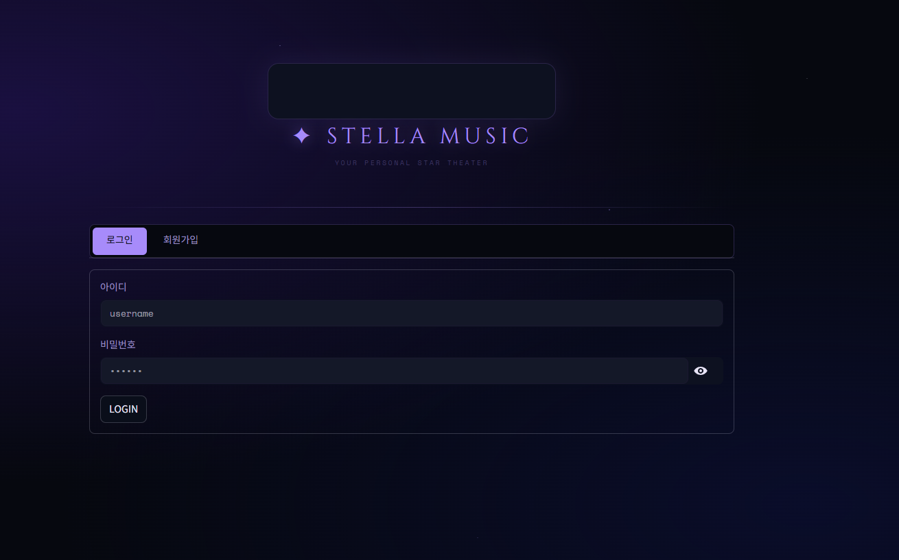
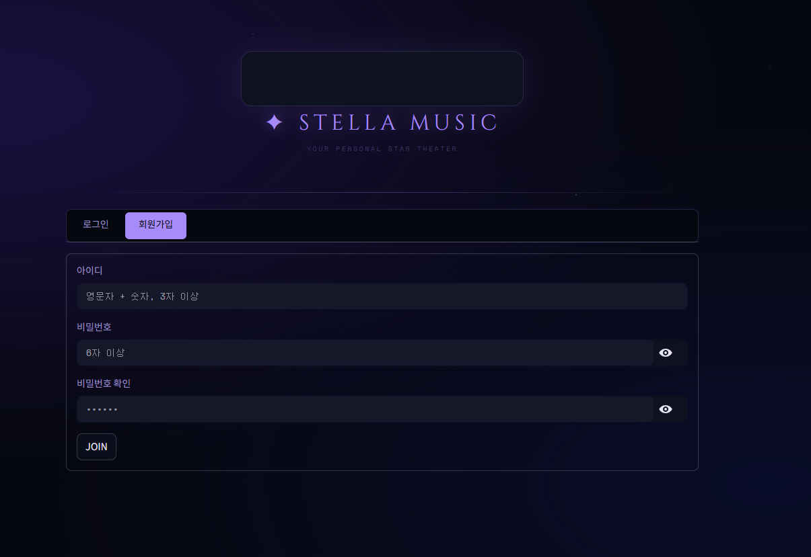
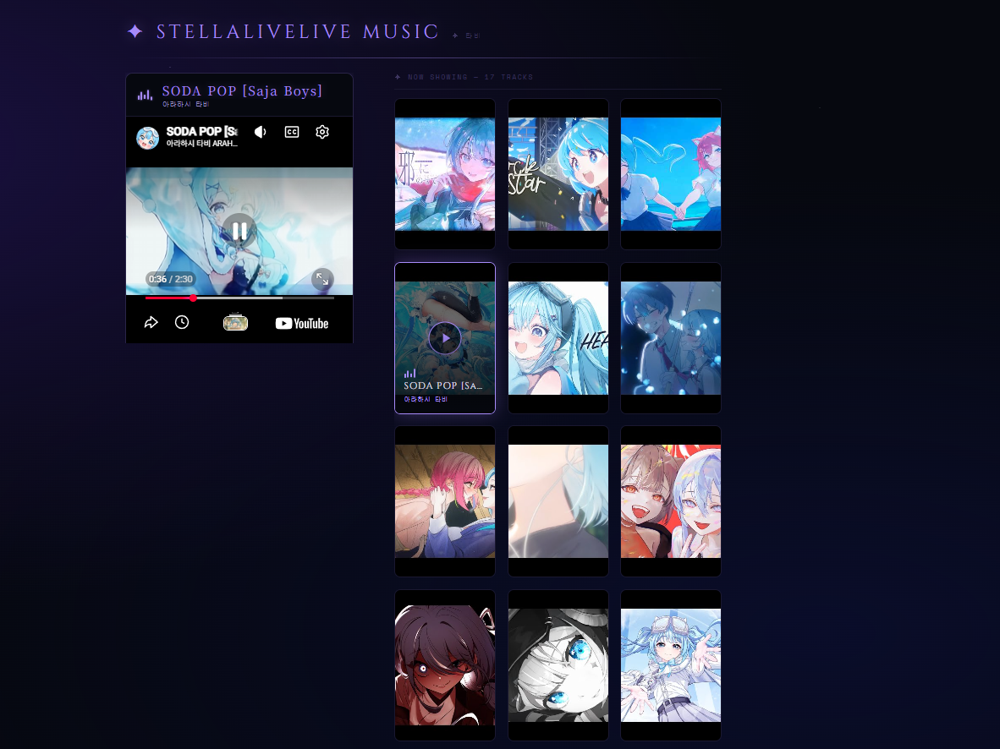
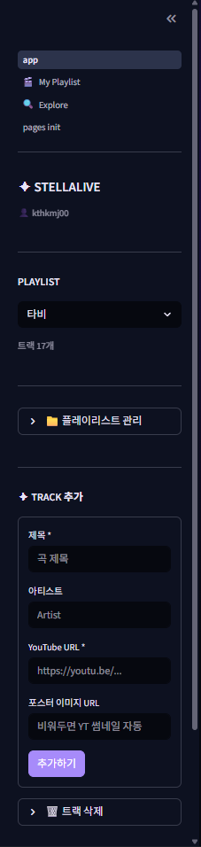
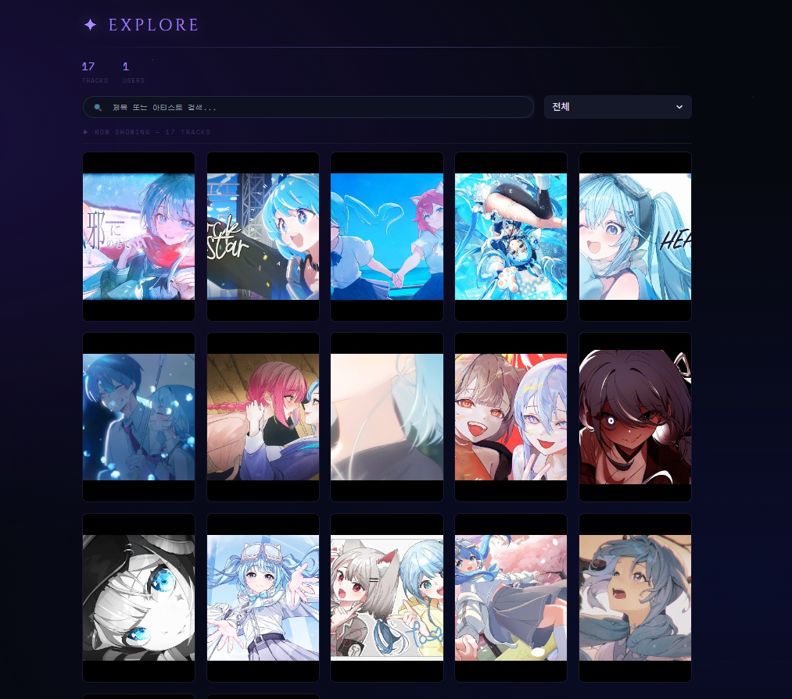
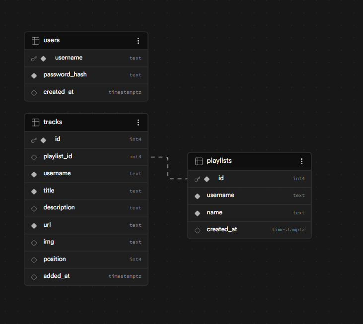
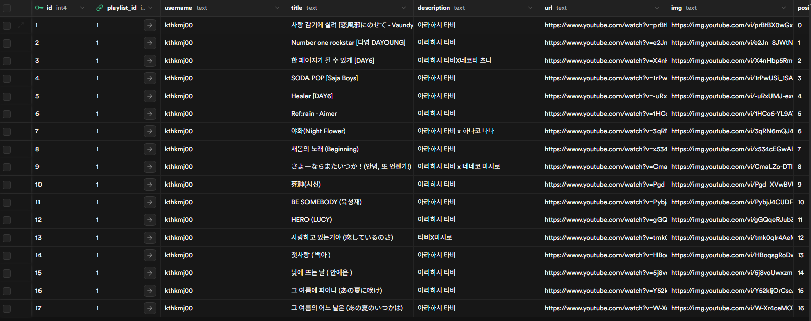

# ✦ STELLALIVE MUSIC PLAYER

> 스텔라 라이브 팬을 위한 개인 유튜브 뮤직 플레이어



---

## 📌 소개

**STELLALIVE MUSIC PLAYER**는 유튜브 링크와 포스터 이미지를 등록해 나만의 시네마 감성 플레이리스트를 만들 수 있는 웹 앱이에요.  
회원가입 후 개인 플레이리스트를 관리하고, 다른 유저의 트랙도 탐색할 수 있어요.

---

## 🖼 스크린샷

### 회원가입



### 메인 플레이어



### 사이드바



### Explore 페이지



### DB 연동 (Supabase)




---

## ✨ 주요 기능

- 🎬 **시네마 포스터 스타일** UI — 앨범 커버를 포스터처럼 나열
- ▶ **유튜브 재생** — 포스터 클릭 시 즉시 재생
- 🔄 **자동 다음 트랙** — 영상 종료 시 다음 트랙 자동 재생
- 👤 **회원가입 / 로그인** — bcrypt 비밀번호 해싱
- 📁 **플레이리스트 관리** — 생성 / 이름 변경 / 삭제
- 🔍 **Explore** — 다른 유저 트랙 탐색 + 검색 + 내 플리에 추가
- ☁️ **Supabase 연동** — 영구 데이터 저장

---

## 🛠 기술 스택

| 분류          | 기술                  |
| ------------- | --------------------- |
| Frontend / UI | Streamlit             |
| 인증          | bcrypt                |
| DB            | Supabase (PostgreSQL) |
| 배포          | Streamlit Cloud       |
| 자동 실행     | GitHub Actions        |

---

## 🚀 로컬 실행

```bash
git clone https://github.com/bird8696/stellalive-music-player.git
cd stellalive-music-player

pip install -r requirements.txt
```

`.streamlit/secrets.toml` 생성:

```toml
[supabase]
url = "YOUR_SUPABASE_URL"
key = "YOUR_SUPABASE_KEY"
```

```bash
streamlit run app.py
```

---

## 🗂 프로젝트 구조

```
stellalive-music-player/
├── app.py                  # 메인 진입점
├── app_config/
│   └── settings.py         # 테마 · 상수 설정
├── app_utils/
│   ├── auth_utils.py       # 인증 로직
│   ├── data_manager.py     # Supabase CRUD
│   ├── db.py               # Supabase 클라이언트
│   └── youtube.py          # YouTube URL 파싱
├── app_components/
│   ├── auth.py             # 로그인 · 회원가입 UI
│   ├── player.py           # YouTube 플레이어
│   ├── poster_wall.py      # 포스터 벽
│   └── sidebar.py          # 사이드바
├── pages/
│   ├── 1_🎬_My_Playlist.py
│   └── 2_🔍_Explore.py
└── .github/workflows/
    └── keep_alive.yml      # 매일 오전 8시 자동 실행
```

---

## 🔗 배포

[](https://stellalive-music-player-fwo69owwhb7vl6y2ineqik.streamlit.app/)

---

## 🎨 출처 · 크레딧

본 프로젝트의 UI 테마 및 일부 이미지는 **아라하시 타비** 님의 콘텐츠에서 영감을 받아 제작되었습니다.

> **아라하시 타비 (荒波子タビ)** — 스텔라 라이브 소속 VTuber  
> 🔗 [YouTube 채널 바로가기](https://www.youtube.com/@arashitabi)

팬 프로젝트로 제작된 비영리 앱이며, 모든 저작권은 원작자에게 있습니다.
